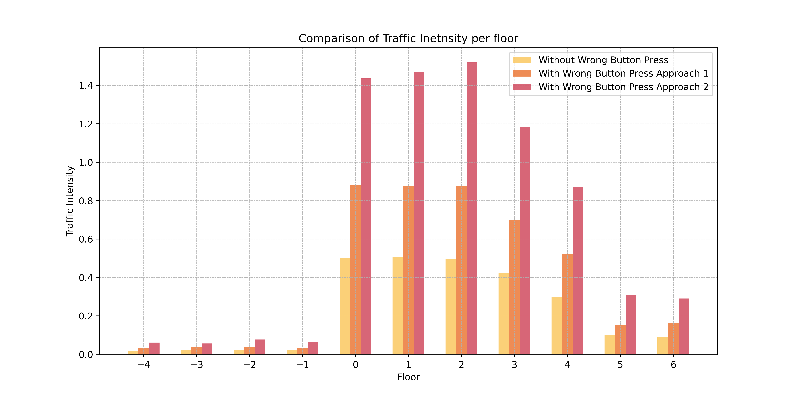
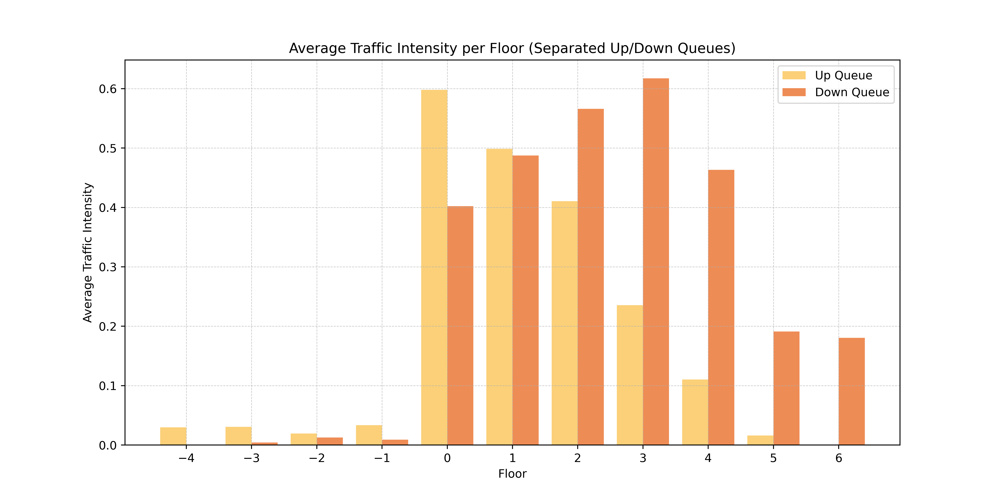

# Elevator Dilemma and Queueing Theory

In this repository, I model a elevator system in crowded buildings like hostpitals. I also address the effect of pressing wrong direction button on elevators door. People often press the wrong button and this causes the queue sizes in front of the elevators to be high and traffic intensisties increase. 

## Introduction
We all get stuck in long queues of elevators in crowded buildings like hospitals just because people keep pressing the wrong direction button. Some want to go up, but they press down, and others want to go down but press the up button. The common mistake is that people in this scenario are actually calling the elevator to come and pick them up. A couple of weeks ago, I decided to study this problem. To solve the issue of wrong button presses, I had to simulate the conditions and then come up with a solution to see if that solution would reduce the queue size in front of the elevators. Queueing Theory is appropriate for solving this problem and can be used to model the service rate of elevators as well as the arrival rates of people at the hospital. In this note, I will share my solution and model to demonstrate how a simple design solution can reduce the intensity of traffic in front of each elevator on a specific floor in the building.

## Results

In the graph below we see the traffic intensities in three case. Light orange is when no one presses the wrong button (which is a miraculous event), second bar is adding the effect of pressing the wrong button added directly to arrival rates, and the third is the traffic intensities of each floor when the pressing the wrong button effect was added both to arrival rates and service rates of elevators. 

In the graph below I applied a solution to modeling in which we removed the direction button on elevators door and replaced it with a single call button, thus eliminating the effect of pressing wrong button. We also assign each elevator to serve in only one direction. The model shows significant reduction in traffic intensities in each floor.

